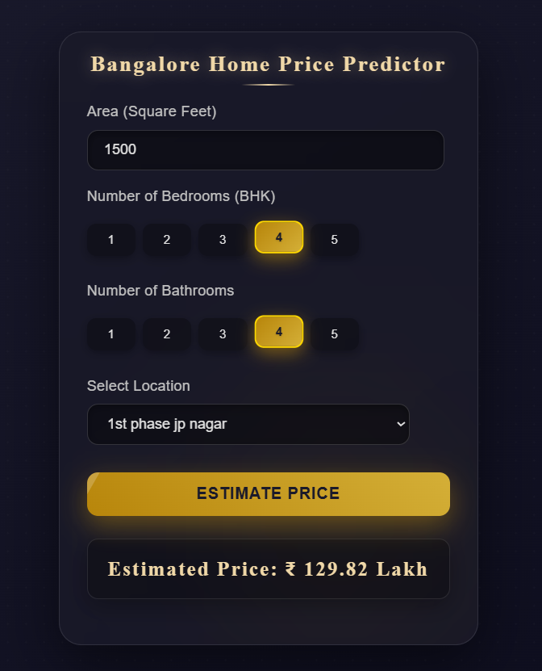

# Bangalore House Price Prediction

A machine learning web app that estimates home prices in Bangalore based on square footage, bedrooms, bathrooms, and location. Built with a scikit-learn model, a Flask backend, and a simple web UI.

## Preview

<div align="center">
  
</div>

## Tech Stack

- Python
- Scikit-learn
- Pandas
- NumPy
- Flask
- HTML
- CSS
- JavaScript (jQuery)

## How It Works

- **Model training**: The dataset (`Bengaluru_House_Data.csv`) is cleaned in a Jupyter notebook (`model/home_prices_model.ipynb`), where outliers are removed, rare locations are grouped, and categorical locations are one-hot encoded. A Linear Regression model is trained and exported as a pickle file alongside the column definitions.
- **Backend API**: A Flask server in `server/` loads the trained pickle model and column list into memory on startup. It exposes `/get_location_names` to fetch available locations and `/predict_home_price` to calculate price estimates.
- **Frontend UI**: A lightweight webpage in `frontend/` takes user inputs (area, BHK, bathrooms, location) and sends an AJAX request to the Flask server to display the estimated price in Lakhs.

## Run It

1. Clone the repository and install dependencies:

```bash
git clone https://github.com/arsalan-99/House_Price_prediction_model.git
cd House_Price_prediction_model

python -m venv .venv
source .venv/bin/activate
pip install -r requirements.txt
```

2. Start the server:

```bash
cd server
python server.py
```

3. Open `frontend/app.html` in your browser.
