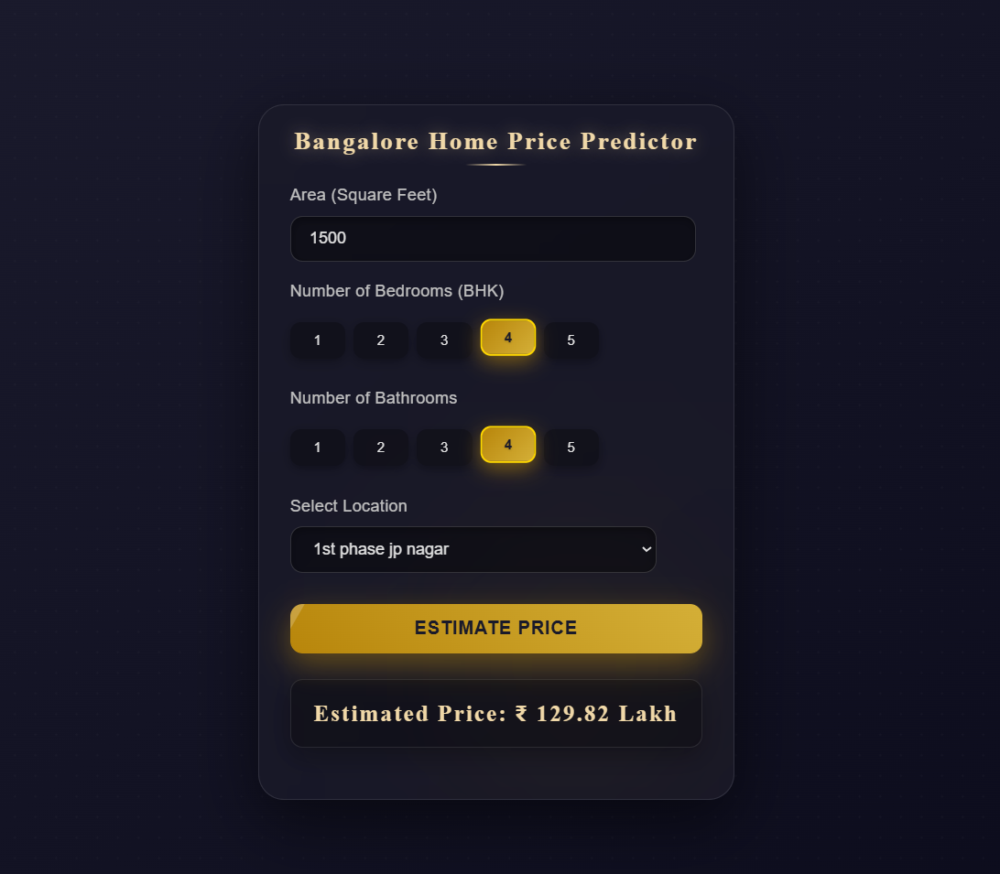

#  Bangalore House Price Prediction Model

This project builds a machine learning model that predicts house prices in Bangalore using key features such as location, total square footage, number of bathrooms, and BHK count. The dataset undergoes thorough preprocessing, including cleaning, outlier removal, feature engineering, and one-hot encoding to ensure high-quality inputs.  
  A Linear Regression model is then trained on the prepared data, achieving around 85% accuracy. The final model can estimate property prices for any given combination of location and home characteristics, making it suitable for integration into web applications or real estate tools.

---

  

## 📦 **Tools, Libraries & Techniques Used**

### **🔧 Libraries used:**
- **Pandas** – Data cleaning & manipulation  
- **NumPy** – Numerical operations  
- **Matplotlib** – Data visualization  
- **Scikit-Learn**  
  - Train–test split  
  - Linear Regression model   

---

### **🧹 Data Cleaning & Preprocessing**
- Dropped irrelevant columns:  
  `area_type`, `availability`, `society`, `balcony`
- Removed missing values  
- Converted mixed-format `total_sqft` values (e.g., `"2100 - 2850"`) to numeric  
- Removed extreme outliers:
  - Unrealistic BHK counts  
  - Total sqft per BHK < 300  
  - Extreme price-per-sqft values   
- Grouped rare locations as `"others"`  
- One-hot encoded 242 location categories   

---

### **🗂️ Dataset & Features**
- Features used after cleaning:
  - `total_sqft`
  - `number of bathrooms`
  - `bhk`
  - One-hot encoded location columns 

---

### **🤖 Machine Learning Model**
- **Algorithm:** Linear Regression  
- **Model Accuracy:** ~ **84.5%**  

hi